# 🚗 UDEVS Car Showroom Management System

A professional frontend-only **Car Showroom Management System** developed using React.js as part of the **U Devs Internship Assignment**.

The system provides separate interfaces and role-based access for **Admin, Sales, Inventory, and Customer** users. It includes car inventory management, supplier management, customer management, applications, dashboards, role-based access control, automatic calculations, and LocalStorage-based data persistence.

> **Important Demo Notice:**  
> This is a frontend-only prototype. All application data, including seeded and created user passwords, is stored in browser LocalStorage in plaintext for demonstration purposes only. This authentication and storage approach must **not** be used in production.

---

## 📌 Project Overview
<h3>📸 Project Screenshots (Click to View Full Size)</h3>

<table>
  <!-- Row 1 -->
  <tr>
    <td width="20%">
      <a href="./public/images/pic1.png" target="_blank">
        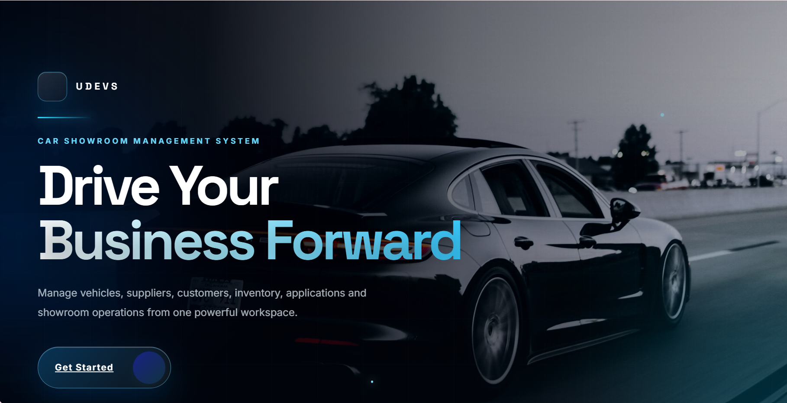
      </a>
    </td>
    <td width="20%">
      <a href="./public/images/pic2.png" target="_blank">
        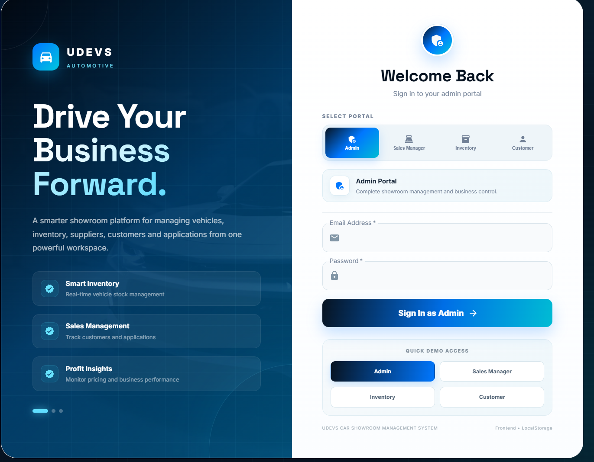
      </a>
    </td>
    <td width="20%">
      <a href="./public/images/pic3.png" target="_blank">
        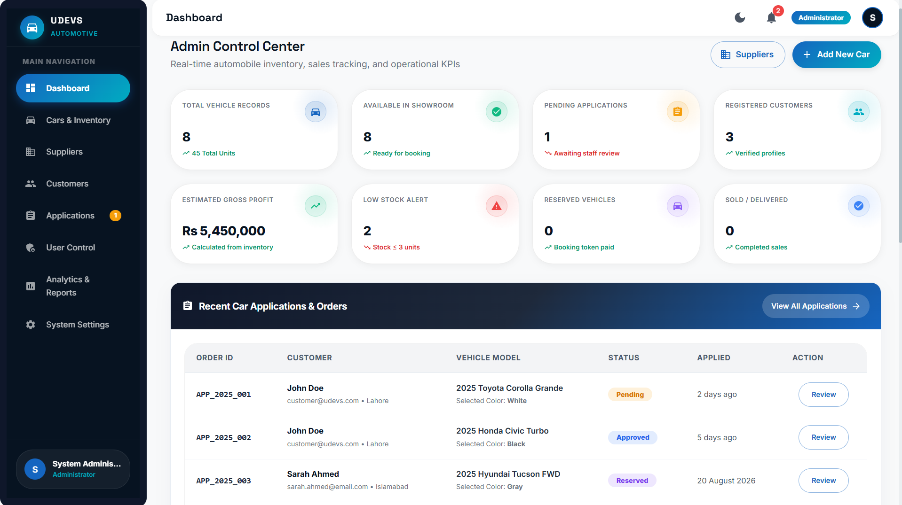
      </a>
    </td>
    <td width="20%">
      <a href="./public/images/pic4.png" target="_blank">
        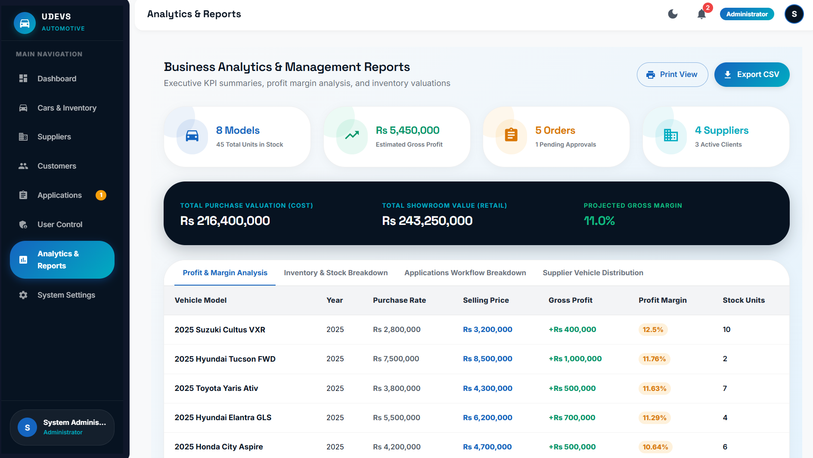
      </a>
    </td>
    <td width="20%">
      <a href="./public/images/pic5.png" target="_blank">
        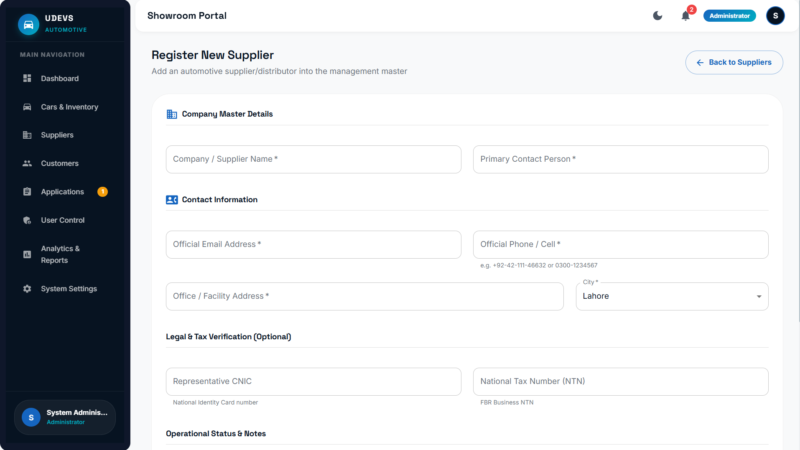
      </a>
    </td>
  </tr>
  <
  <tr>
    <td width="20%">
      <a href="./public/images/pic6.png" target="_blank">
        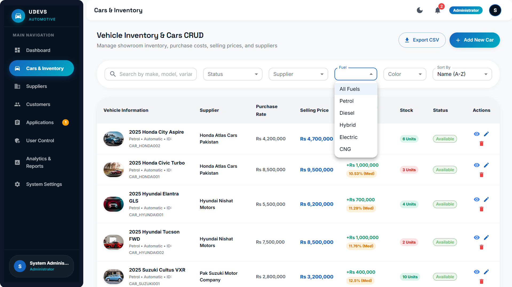
      </a>
    </td>
    <td width="20%">
      <a href="./public/images/pic7.png" target="_blank">
        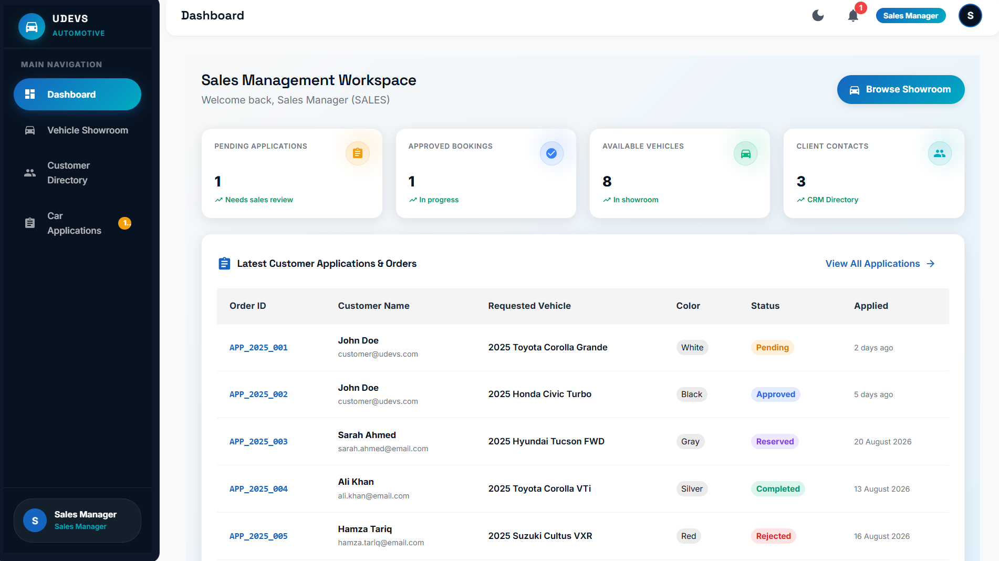
      </a>
    </td>
    <td width="20%">
      <a href="./public/images/pic8.png" target="_blank">
        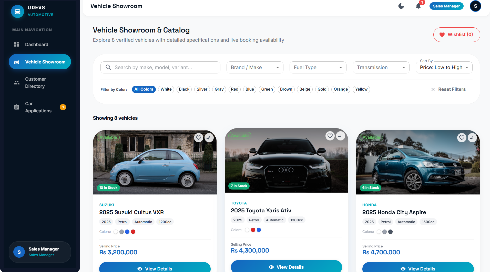
      </a>
    </td>
    <td width="20%">
      <a href="./public/images/pic9.png" target="_blank">
        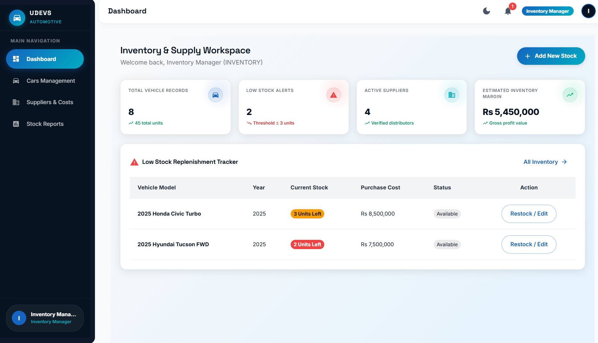
      </a>
    </td>
    <td width="20%">
      <a href="./public/images/pic10.png" target="_blank">
        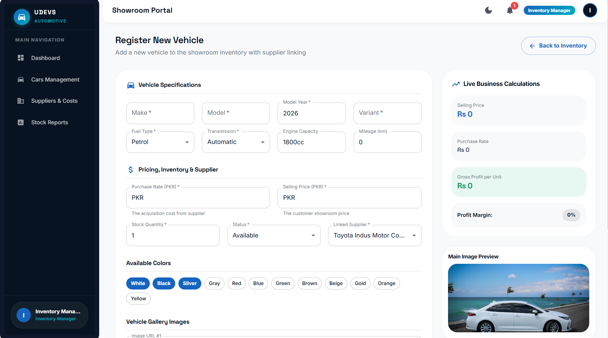
      </a>
    </td>
  </tr>

  <tr>
    <td width="20%">
      <a href="./public/images/pic11.png" target="_blank">
        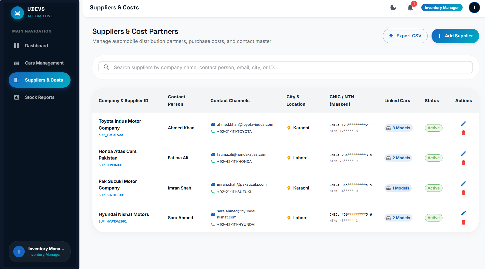
      </a>
    </td>
    <td width="20%">
      <a href="./public/images/pic12.png" target="_blank">
        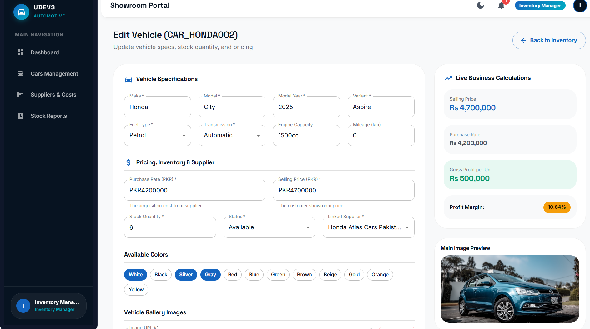
      </a>
    </td>
    <td width="20%">
      <a href="./public/images/pic13.png" target="_blank">
        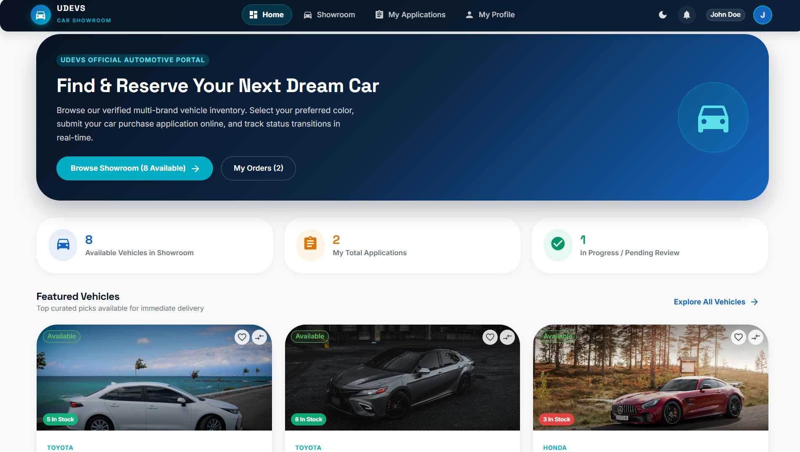
      </a>
    </td>
    <td width="20%">
      <a href="./public/images/pic14.png" target="_blank">
        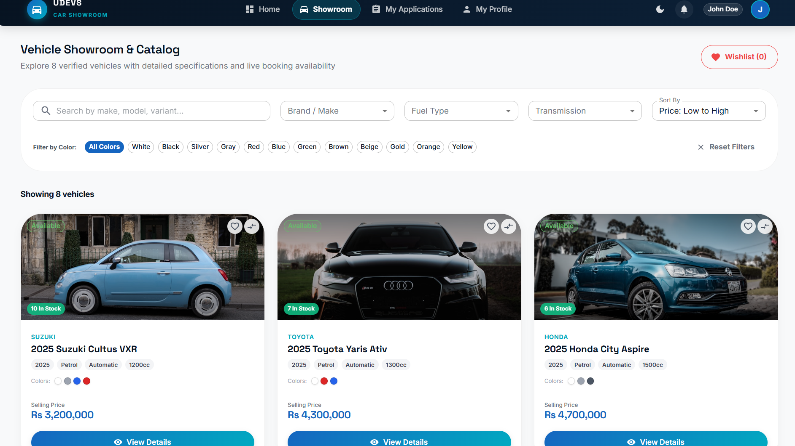
      </a>
    </td>
    <td width="20%">
      <a href="./public/images/pic 15.png" target="_blank">
        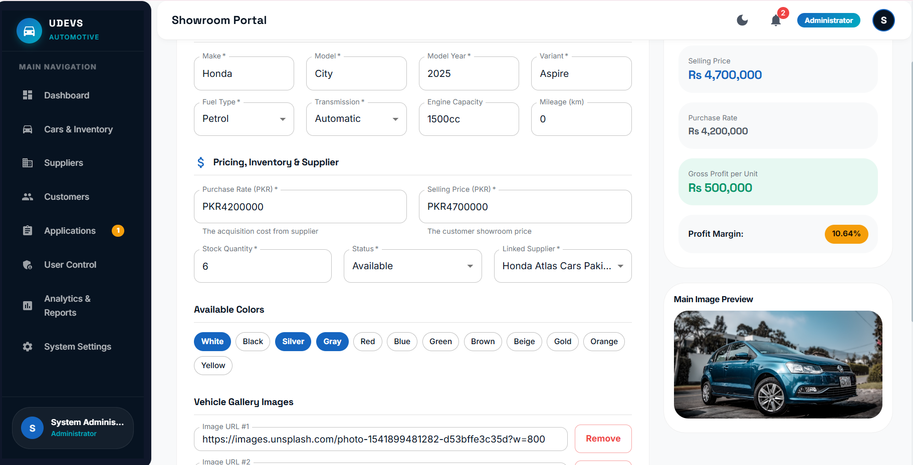
      </a>
    </td>
  </tr>


</table>

The UDEVS Car Showroom Management System is designed to demonstrate a complete frontend workflow for managing a car showroom.

The application includes:

- Role-based authentication and authorization
- Admin dashboard
- Sales dashboard
- Inventory dashboard
- Customer portal
- Car inventory management
- Supplier management
- Customer management
- Application management
- Activity logging
- Notifications
- Search, filtering, and sorting
- Automatic profit and profit margin calculations
- LocalStorage data persistence
- Responsive user interface

The core showroom demo remains runnable without a backend. The User Control module is API-ready and uses the configured backend when `VITE_API_URL` is available, with LocalStorage fallback for local demonstration.

---

## Redux User Management Module

The admin User Control page uses a production-style Redux Toolkit flow:

`Users page/components -> async thunk -> Axios user API service -> user reducer -> UI`

It supports fetching, creating, updating, and safely deleting users, with validation for required fields, email format, duplicate email addresses, roles, statuses, loading states, API errors, empty results, and last-administrator protection. Existing LocalStorage data is used as a development fallback when `VITE_API_URL` is not configured, so the frontend remains runnable without a backend.

To connect the module to the group backend, copy `.env.example` to `.env` and set:

```bash
VITE_API_URL=http://localhost:5000/api
```

For the provided backend controller, the adapter uses `GET /user`, `POST /user`, `PUT /user` (with `id` in the JSON body), and `DELETE /user/:id`. It unwraps the backend's `{ data: { users } }` and `{ data: { newUser } }` response shapes and maps backend `userType` values to the existing showroom roles.

---

## 🚀 Features

### 👨‍💼 Admin

- Admin dashboard with key business statistics
- Manage users
- Manage cars
- Manage suppliers
- Manage customers
- Manage applications
- View reports
- Manage system settings
- View activity logs
- View notifications
- Full system access

### 💼 Sales

- Sales dashboard
- View showroom
- Manage customers
- Manage customer applications
- Update application statuses
- View customer-related information

### 📦 Inventory

- Inventory dashboard
- Add and manage cars
- Update car inventory
- Manage suppliers
- View inventory reports
- Monitor stock availability

### 👤 Customer

- Customer dashboard
- Browse available cars
- Search and filter cars
- View detailed car information
- Select available car colors
- Submit car applications
- Track application status
- View personal applications
- Manage profile

---

## 🛠 Technology Stack

| Technology | Purpose |
|------------|---------|
| React 19.2.8 | Frontend framework |
| JavaScript / JSX | Application development |
| Material UI (MUI) | UI components |
| Redux Toolkit + React Redux | User CRUD state management |
| Axios | User API requests |
| React Router DOM | Application routing |
| CSS | Responsive layouts and dark-mode styling |
| LocalStorage | Client-side data persistence |
| Vite 8.2.2 | Development and build tool |

---

## 📋 Prerequisites

Before running the project, make sure you have:

- Node.js v18 or higher
- npm or yarn

---

## 🚀 Installation & Setup

### 1. Clone the repository

```bash
git clone <repository-url>
cd "CAR SHOWROOM MANAGEMENT SYSTEM"
```
2. Install dependencies
```bash
npm install
```
3. Start the development server
```bash
npm run dev
```
5. Open the application
```bash
Open the URL displayed in your terminal.
Usually:
http://localhost:5173
```
📸 Screenshots
### Project Structure
```bash
src/
├── components/
│   ├── applications/
│   ├── cars/
│   └── common/
│
├── context/
│   ├── AuthContext.jsx
│   └── ThemeModeContext.jsx
│
├── data/
│   ├── seedActivityLogs.js
│   ├── seedApplications.js
│   ├── seedCars.js
│   ├── seedCustomers.js
│   ├── seedData.js
│   ├── seedNotifications.js
│   ├── seedSuppliers.js
│   └── seedUsers.js
│
├── layouts/
│   ├── AdminLayout.jsx
│   └── CustomerLayout.jsx
│
├── pages/
│   ├── admin/
│   ├── customer/
│   ├── home/
│   ├── staff/
│   └── auth/
│
├── routes/
│   ├── AppRoutes.jsx
│   ├── ProtectedRoute.jsx
│   └── RoleRoute.jsx
│
├── services/
│   └── localStorageService.js
│
├── theme/
│   └── theme.js
│
├── utils/
│   ├── calculations.js
│   ├── constants.js
│   ├── formatters.js
│   └── validators.js
│
├── App.jsx
├── index.css
└── main.jsx
```
Dummy Login Credentials

The following seeded accounts are available for demonstration.
### 👨‍💼 Admin
```bash
Email: admin@udevs.com
Password: Admin@123
```
Access: Full system access including users, settings, reports, cars, suppliers, customers, and applications.

##💼 Sales Manager
```bash
Email: sales@udevs.com
Password: Sales@123
```
Access: Dashboard, showroom, customers, and applications.

##📦 Inventory Manager
```bash
Email: inventory@udevs.com
Password: Inventory@123
```
Access: Dashboard, cars, suppliers, and inventory reports.

## 👤 Customer
```bash
Email: customer@udevs.com
Password: Customer@123
```
### Role Permissions
Access: Customer dashboard, showroom, profile, and personal applications.
```bash
| Feature                 | Admin | Sales | Inventory | Customer |
|-------------------------|:-----:|:-----:|:---------:|:--------:|
| Dashboard               |  ✅   |  ✅   |    ✅     |    ✅    |
| Cars Management         |  ✅   |  ❌   |    ✅     |    ❌    |
| Suppliers Management    |  ✅   |  ❌   |    ✅     |    ❌    |
| Customers Management    |  ✅   |  ✅   |    ❌     |    ❌    |
| Applications Management |  ✅   |  ✅   |    ❌     | Own Only |
| Users Management        |  ✅   |  ❌   |    ❌     |    ❌    |
| Reports                 |  ✅   |  ❌   |    ✅     |    ❌    |
| Settings                |  ✅   |  ❌   |    ❌     |    ❌    |
| Showroom                |  ✅   |  ✅   |    ❌     |    ✅    |
| Profile                 |  ✅   |  ✅   |    ✅     |    ✅    |
```
### LocalStorage

The existing showroom modules use browser LocalStorage. The User Control module uses the configured REST API when `VITE_API_URL` is set and automatically falls back to LocalStorage when it is not configured.
```

### User API Configuration

Copy `.env.example` to `.env` and set the backend base URL:

```bash
VITE_API_URL=http://localhost:5000/api
```

User endpoints:

| Method | Endpoint | Purpose |
|--------|----------|---------|
| GET | `/user` | Fetch users |
| POST | `/user` | Create a user |
| PUT | `/user` | Update a user; send `id` in body |
| DELETE | `/user/:id` | Delete a user |

The User Control page dispatches Redux async actions for all CRUD operations and updates the table from reducer state without requiring a page refresh. It includes validation, duplicate-email handling, loading/error feedback, search, CSV export, confirmation before deletion, and protection against deleting the last administrator.bash
udevs_users
udevs_session
udevs_cars
udevs_suppliers
udevs_customers
udevs_applications
udevs_notifications
udevs_activity_logs
udevs_settings
```
## Data Persistence

All application data remains available after refreshing the page because it is stored in LocalStorage.

However, LocalStorage is device and browser specific.
## Automatic Calculations

The system automatically calculates important showroom metrics.

## Profit
```bash
Profit = Selling Price - Purchase Rate
```
## Profit Margin
```bash
Profit Margin = (Profit / Selling Price) × 100
```
## Alerts

Cars with stock quantity less than or equal to 3 are treated as low-stock items.

## Dashboard KPIs

Dashboard statistics are updated based on the current LocalStorage data.

### Search, Filter & Sort

The application provides data management features including:

- Full-text search
- Make filtering
- Model filtering
- Fuel type filtering
- Transmission filtering
- Status filtering
- Price filtering
- Sorting by price
- Sorting by year
- Sorting by stock
- Sorting by name
## Validation
- Car Validation
- Make is required
- Model is required
- Variant is required
- Year is required
- Purchase rate is required
- Selling price is required
- Colors are required
- Stock must be a non-negative integer
- Fuel type is required
- Transmission is required
- Status is required
- Supplier is required
- Year must be between 2000 and current year + 2
## Supplier Validation
- Company name is required
- Contact person is required
- Email is required
- Phone number is required
- Address is required
- City is required
- Email format is validated
- Pakistani phone number format is validated
## ✅ Application Validation

- Full name is required
- Email is required
- CNIC is required
- Cell number is required
- Address is required
- City is required
- Car selection is required
- Color selection is required
- Email format is validated
- CNIC format is validated
- Pakistani phone number format is validated

---

## 🔄 Application Workflow

### 1. Inventory Setup

Admin or Inventory Manager can:

- Add suppliers
- Add cars
- Set purchase and selling prices
- Configure stock
- Set available colors
- Manage inventory information

### 2. Customer Journey

Customers can:

- Open the showroom
- Search and filter cars
- View car details
- Select an available color
- Submit an application
- Track application status

### 3. Staff Processing

Admin or Sales users can:

- Review applications
- Update application status
- Approve or reject applications
- Reserve applications
- Complete applications
- Review notifications
- Track activity logs

---

## 📝 Application Status Workflow

Applications can move through the following statuses:

```text
Pending
   ↓
Approved
   ↓
Reserved
   ↓
Completed
```
An application can also be:

- **Rejected**

Status changes generate relevant notification and activity log entries.

---

## 🎨 UI/UX Features

- Responsive design
- Desktop, tablet, and mobile support
- Responsive user-management statistic cards
- Dark-mode readable cards, tables, forms, and dialogs
- Professional showroom interface
- Material UI components
- Custom CSS styling
- Role-specific navigation
- Confirmation dialogs
- Status chips
- Search controls
- Filter controls
- Color selectors
- Empty states
- Loading states
- Error states
- Notifications
- Activity logs

---

## 🧪 Testing Checklist

- [x] Admin login
- [x] Sales login
- [x] Inventory login
- [x] Customer login
- [x] Role-based navigation
- [x] Protected routes
- [x] Car CRUD operations
- [x] Supplier management
- [x] Customer management
- [x] Application management
- [x] Application status workflow
- [x] Customer showroom
- [x] Car details
- [x] Application submission
- [x] Search functionality
- [x] Filtering functionality
- [x] Sorting functionality
- [x] Form validation
- [x] LocalStorage persistence
- [x] Automatic profit calculation
- [x] Responsive design
- [x] Notifications
- [x] Activity logging

---

## ⚠️ Known Limitations

This project is intentionally designed as a frontend-only demonstration.

- No backend server
- No database
- No real authentication
- Passwords are stored in LocalStorage for demonstration
- No payment processing
- No real email or SMS service
- LocalStorage is device/browser specific
- External image URLs are used instead of file uploads
- No production-level security

---

## 🚀 Future Improvements

Possible future improvements include:

- Node.js / Express backend
- MongoDB or PostgreSQL database
- JWT-based authentication
- Secure password hashing
- Payment gateway integration
- Email and SMS notifications
- Car image upload system
- Advanced reporting and analytics
- Multi-language support
- Mobile application
- Cloud database integration

---

## 📞 Project Information

- **Project:** UDEVS Car Showroom Management System
- **Program:** U Devs Internship Assignment
- **Type:** Frontend Prototype
- **Technology:** React.js
- **Data Storage:** Browser LocalStorage

---

## 📄 License

This project was developed as part of the **U Devs Internship Program** for educational and demonstration purposes.
